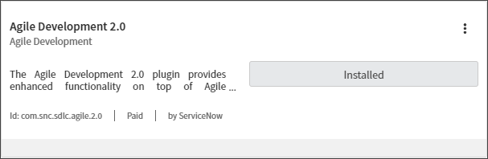
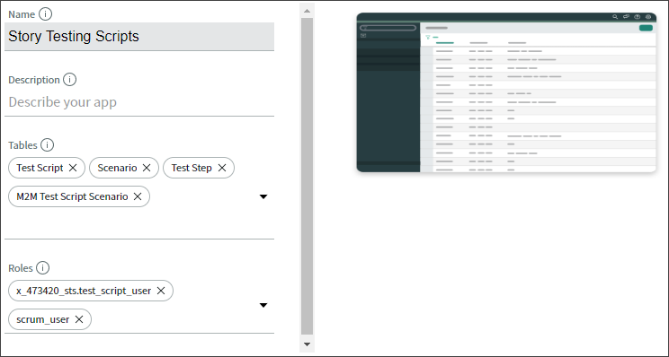
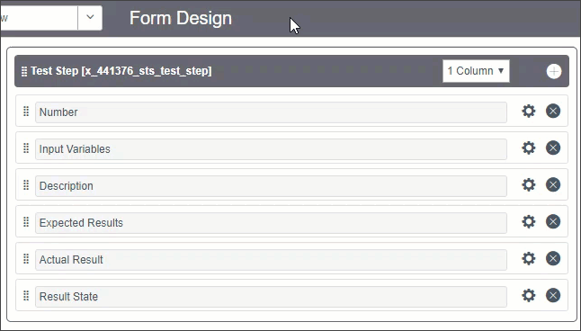

# Lab 0: Introduction

## Goal
The Story Testing Scripts Scoped Application lab will guide users on how to use ServiceNow&reg; Studio IDE to build out a custom application that helps create test scripts for stories. Developers are often confused on what requirements are needed by the quality assurance team for testing. This will break down the test script process into what users they should be impersonating, the steps they should be taking and more. This lab will go over what should be included in a best practice test script and how to build a scoped application to record test scripts in ServiceNow instead of in Excel or another system. This lab will touch developers on Studio IDE, story best practices, scoped applications, and process improvement.

# Lab 1: The Fundamentals of Testing Scripts
Test scripts are sets of instructions that can be performed on a system to validate the behaviour is working as expected for the given functionality. 

## What are testing scripts and why should I use them?
There are two applications in ServiceNow for executing test scripts: 
  * Test Management - used to manage manual testing 
  * Automated Test Framework - used for automated testing

In this lab, we will configure the platform to use both applications.

To activate, in the application navigator, go to Plugins and activate each of the following plugins:
  * a. Agile Development 2.0
  * b. Agile development 2.0 ATF Tests
  * c. Test Management 2.0
  * d. Test Management 2.0 - ATF Tests 
  * e. Automated Test Framework (already enabled)

## Planning the layout of our application
In this lab, we've identified a commonly used test template using excel. We've high-lighted where to potentially track other values so that integration with Test Management and Automated Test Framework can be implemented.

# Lab 2: Starting with ServiceNow&reg; Studio IDE

## Create the Scoped Application

1. Navigate to **System Applications > Studio.**  

2. Click the **Create Application** button.  

3. Click the **Let's get started** button on the "Welcome to the new way to set up your apps"

4. Fill out the following values on the "General Info" tab:

**Name:** Story Testing Scripts  
**Description:** Create testing scripts for stories.  
**Scope:** x_441376_sts (Note, your instance may have a different number.  

5. Drag the "checkbox.png" image from the lab files to the "Drag or drop" icon area.

6. Verify all the information is correct and click **Create**  

7. On the "Let's create some roles for this app", click the **+Create new role** 

8. Enter in "test_script_user" in the "New role name" field and click **Create**  

9. The role should now appear in the "Roles" list with the scope in front of it.

    

10. Click **Continue** to go to the next step.

11. Our application will be used on stories in the classic view of ServiceNow. Select **Classic** and click **Continue** to go to the next page.  

12. You should now see the "Which data tables do you want to use for this app?" We will be building out new tables based on the arhitecture we mentioned previously in lab 1. Click on **Create new table**.  

13. On the next screen select the **Create table from scratch** and click **Continue**.  

14. We will be createing a table for the test scripts first. Go ahead and click **Add a new field** and put in the following:  
  

Add the following fields to the Test Script table:

Field Label | Field Name | Type | Length | Reference
------------ | ------------- | ------------- | ------------- | -------------
Name | name | String | 100 |
Description | description | String | 1000 |
Story | story | Reference | 32 | Story [rm_story]
Tested By | tested_by | Reference | 32 | User [sys_user]
Reviewed By | reviewed_by | Reference | 32 | User [sys_user]
Version | version | Integer |  | 
QA Tester's Notes | qa_tester_s_notes | String | 1000
Reviewer's Notes | reviewer_s_notes | String | 1000

15. Click **Continue** after you have added all the fields to the table.

16. Now we will name the table the following:

**Table label:** Test Script  
**Table name:** x_441376_sts_test_script (Your instance may have a different number in the table name.)   
**Make extensible:** true

17. Click the **Continue** button to create the table. It may take the system a few seconds to create the table.

18. You should see a "Success! Your table is ready" screen. Click on **continue** to build the Scenario table next.

19. You should see the "Test Script" table is now in the "Tables" field of our app. We now need to add the Scenario table next. Let's go through the same proccess and click **Create new table**.

20. Click on the **Create table from scratch** and then click **Continue**.

21. Now you should see the "+ Add a new field" screen. Go ahead and click **+ Add a new field** to add the fields for the Scenario table with the information below.

Add the following fields to the Scenario table:

Field Label | Field Name | Type | Length | Reference
------------ | ------------- | ------------- | ------------- | -------------
Name | name | String | 100 |
Description | description | String | 1000 |  
Prerequisites | prerequisites | String | 1000 | 
Personas | personas | String | 1000 | 
Company | company | Reference | 32 | Company [core_company]

22. Verify the fields and click **continue** to go to the table naming page.  

23. Name the table with the information below and then click **Continue** to create the table. It may take a few seconds for the table to be created.

**Table label:** Scenario  
**Table name:** x_441376_sts_scenario (Your instance may have a different number in the table name.)   
**Make extensible:** true  

24. You should see the "Success! Your table is ready" page. Click **Continue** to move onto the next page.

  

25. You should now see the "Test Script" table and the "Senario" table listed in the tables for your application. We are going to repeat the process two more times for the "Test Steps" table. Go ahead and click **Create new table**.

  

26. Click on the **Create table from scratch** and then click **Continue**.

27. Now you should see the "+ Add a new field" screen. Go ahead and click **+ Add a new field** to add the fields for the Test Steps table with the information below.

Add the following fields to the Test Steps table:

Field Label | Field Name | Type | Length | Reference
------------ | ------------- | ------------- | ------------- | -------------
Number | number | String | 40 |
Description | description | String | 1000 |
Input Variables | input_variables | String | 1000 | 
Expected Results | expected_results | String | 1000 | 
Actual Result | actual_result | String | 1000 | 
Result State | result_state | Choice | Dropdown with none  | 
Test Script | test_script | Reference | 32 | Test Script [x_441376_sts_test_script]

28. Verify the fields and click **continue** to go to the table naming page.  

29. Name the table with the information below and then click **Continue** to create the table. It may take a few seconds for the table to be created.

  

**Table label:** Test Step   
**Table name:** x_441376_sts_test_step (Your instance may have a different number in the table name.)  
**Make extensible:** true  

30. You should see the "Success! Your table is ready" page. Click **Continue** to move onto the next page.  

31. You should now see the "Test Script" table, "Senario" table and "Test Steps" table listed in the tables for your application. We are going to repeat the process one last time for the "M2M Test Script Scenario" table. Go ahead and click **Create new table**.

32. Click on the **Create table from scratch** and then click **Continue**.

33. Now you should see the "+ Add a new field" screen. Go ahead and click **+ Add a new field** to add the fields for the M2M Test Script Scenario table with the information below.

Field Label | Field Name | Type | Length | Reference
------------ | ------------- | ------------- | ------------- | -------------
Scenario | scenario | Reference |  32  | Scenario [x_441376_sts_scenario] | 
Test Script | test_script | Reference | 32 | Test Script [x_441376_sts_test_script] |

34. Verify the fields and click **continue** to go to the table naming page.  

35. Name the table with the information below and then click **Continue** to create the table. It may take a few seconds for the table to be created.

 

**Table label:** M2M Test Script Scenario   
**Table name:** x_441376_sts_m2m_test_script_scenario (Your instance may have a different number in the table name.)  
**Make extensible:** true 

36. You should see the "Success! Your table is ready" page. Click **Continue** to move onto the next page. 

37. You should now see the "Test Script", "Senario", and "Test Step", "M2M Test Script Scenario" table listed in the tables for your application. We have completed creating all the tables we need for our application. Click **Done with tables**.  

 

38. You should now be on the "OK. It's time to design your apps!" page. On our classic application click **start** to jump into Lab 3. 

 

# Lab 3: How to design your application  
## Designing the Layout

1. You should be on the "OK. Let's customer the design of your Classic App" screen. Fill in the the application details as you see them below. When you are ready, click **Create** to create the application.  

  

**Name:** Story Testing Scripts  
**Description:** Create testing scripts for stories.  
**Tables:** Test Script, Scenario, Test Step  
**Roles:** test_script_user, scrum_user  

2. You should now be on the "Nice! Here are the apps you've designed so far" screen. Review your Story Testing Scripts appliation and click **Done with apps**.   

3. Now that the app is created, you can click **Done** on the next page.

4. In the "Select Application" menu. Select the "Story Testing Scripts" by clicking on the **Story Testing Scripts** name.  

  

5. Now we will work on setting up the form layouts for all the tables. In the Application Explorer go to **Data Model -> Tables -> Test Script**.  

 

6. The Test Script table should show up in a new tab in the Studio content frame. Scroll down to the bottom of the Test Script table record. Click on **Design Form** in the related list section of the table record.  

 

7. * In the Form Designer, change the first section to be a **2 Column layout**. 
   * Then drag the Name, Version, Story, Reviewed By, and Tested By fields to the top section.
   *  Move the Description field to the bottom 1 column section. 
   * There should be no fields in the middle section. 
   * Go ahead and delete the section by clicking on the **X** in the corner. 
   * Finally, click the **Save** button to save the layout.

  

Notice that a **Forms & UI -> Forms -> Test Script [Default view]** menu option was created in the Studio Application Explorer.  

8. Now we will work on setting up the form layout for the scenario table. In the Application Explorer go to **Data Model -> Tables -> Scenario**.

9. The Scenario table should show up in a new tab in the Studio content frame. Scroll down to the bottom of the Scenario table record. Click on **Design Form** in the related list section of the table record. 

  

10.  * In the Form Designer, add a new section by clicking on the **+**. 
     * Make the new section a 1 Column section by clicking the **2 Column** drop-down list and selecting **1 Column**. 
     * Drag down the **Prerequisites** and **Description** fields down to the new section on the bottom. 
     * Next change the the top Scenario section to a 2 Column section by clicking **1 Column** in the drop-down list and selecting **2 Column**. 
     * Now drag the **Personas** and the **Company** field to the right side of the top section. 
     * If it matches the video below, go ahead and click **Save**.

  

Notice that a **Forms & UI -> Forms -> Scenario [Default view]** menu option was created in the Studio Application Explorer.  

11. Now we will work on setting up the form layout for the scenario table. In the Application Explorer go to **Data Model -> Tables -> Test Step**.

12. The Test Step table should show up in a new tab in the Studio conetent frame. Scroll down to the bottom of the Test Step table record. Click on **Design Form** in the related list section of the table record. 

  

13. In the Form Designer, drag the **Description** field above the **Input Variables** field in the Test Step section. Once completed, click **Save**.  

  

Notice that a **Forms & UI -> Forms -> Test Step [Default view]** menu option was created in the Studio Application Explorer.  

## Add Choices to the Result State Field

1. We now need to add choices to our **Result State** variable on the Test Step table. Navigate to **Data Model -> Tables -> Test Step**.

2. Under the **Columns** tab, click on the **Result State** dictionary entry record.

3. At the bottom of the Result State dictionary entry, click on the **Choices** tab and then click **New** to create a new choice.

  

4. In the new choice record make sure the fields are filled out with the below information. Verify the information in the form and click **Submit** to submit the choice.

Label |  Value | Element | Sequence
------------ | ------------- | ------------- | -------------
Pass | pass | result_state | 0  

  

5. Once you submit the form it will return you back to the choice you just submitted. Add the remaining choices below by changing the information on the choice. Then right-click the top banner and click **Insert and Stay**.

Result State choice list:

Label |  Value | Element | Sequence
------------ | ------------- | ------------- | -------------
Fail | fail | result_state | 10
Suspended | suspended | result_state | 20
Not Tested | not_tested | result_state | 30

After inserting all of the choices you should see them in choice list.

## Add Test Scripts as a Related List

Next we will work on creating a global update set to capture the Test Script related list we will be adding to the Story form.

1. Let's turn on the developer Update Set and Scope in the header. Start by clicking on the **gear** icon in the top right corner.

2. Turn on **Show application picker in header** and **Show update set picker in header** under the **Developer** tab.

3. In the application picker in the header, change the application to **Global**.

4. In the left navigation bar, go to **System Update Sets -> Local Update Sets**. 

  

5. At the top of the Update Sets List, click **New**.

6. Fill out the update set with a deTestintailed name and description.

Field |  Value 
------------ | ------------- 
Name | Story Testing Scripts - Global - Story Form Layout
State | In progress
Application | Global
Description | Added the Test Scripts related list to the Story (rm_story) form's scrum view.  

7. Click **Submit and Make Current** to save the update and set it as your current update set. You should now see the new update set in the update set picker in the header.

8. In the left navigation bar, go to **Agile Development -> Stories**.

9. Once the list of stories load **click** on one of the stories to view the stories form. 

10. Next open the form's context menu by **Right clicking** on the form's gray banner at the top. 

11. In the context menu, go to **Configure -> Related Lists**. 

12. You should now see the related list, list collector for the Scrum view. In the **Available** list on the left select **Test Script->Story** to highlight it. To move it over to the **Selected** list on the right, **click** the **>** icon. Once the **Test Script->Story** related list has been moved over, click the **Save** button.

# Lab 4: Recording Test Scripts

## Build your first test script  

1. In the application select **Data Model -> Tables -> Test Script**

 

2. Right click on the top banner and go to Configure -> Related Lists.

  

3. You should now see the related list, list collector for the Scrum view. In the Available list on the left select M2M Test Script Scenario->Test Script and Test Step->Test Script to highlight it. To move it over to the Selected list on the right, click the > icon. Once the M2M Test Script Scenario->Test Script and Test Step->Test Script related list has been moved over, click the Save button.

4. In the left navigation bar go to **Story Testing Scripts > Test Script > Create New**

5. Create a new Test Scipt with the following:

**Name:** Verify Service Desk Managers group, users, and roles  
**Story:** The IT Director would like a new group in ServiceNow called "Service Desk Managers"    
**Description:** This test should check that the Service Desk Managers group was created. That at least one of the users in the group is now apart of that group. Lastly check another user in the group for the "itil" role.  
**Version:** 1   

6. Click save on the top banner and under the form you should see a M2M Test Script Scenarios Form.  

7. next to M2M Test Script Scenario we would like to add an edit button to manage scenarios easier. For this we go to column options and choose Configure List Control.  

8. In List Control form at the bottom select "Enable Edit" and it should redirect to the previous form.  

9. After Test Script is all configured we now will create a new scenario for our test script. In the left navigation bar go to **Story Testing Scripts > Scenario > Create New**

10. In the new choice record, make sure the fields are filled out with the below information. Verify the information in the form and click Submit to submit the choice.   

**Name:** Admin User  
**Personas:** admin  
**Company:** ACME Americas (Your choice of a company)  
**Prerequisites:** Must have the admin role.  
**Description:** Designed to test as an ServiceNow admin user.  

11. After creating the scenario let's go back to Test Script and Create M2M Test Script Scenario by pressing New button.  

12. In the M2M Test Script Scenario form we select the Scenario magnifying glass and search for our created Scenario and Press **Submit**

  

13. Now the Test Scripts, M2M Test Script Scenarios should have newly inserted Scenario of Admin User.  

  

14. To view more information we will update the the List Layout of M2M Test Script Scenarios by going to **Context Menu -> List Layout**. 

  

15. Arrange the list layout as shown to view information about the Scenario.  

16. Now you should see more infomration about M2M Test Script Scenario.

17. The next step is creating the Test Step. Go back to the Test Script form and select Test Step next to M2M Test Script Scenarios and click on **New**.

18. In the new Test Step record make sure the fields are filled out with the below information. Verify the information in the form and click Submit.  

**Number:** 1  
**Description:** Login as Beth  
**Input Values:** username= password=    
**Expected Results:** Should login to ServiceNow UI  
**Actual Results:**

# Lab 5: Best Practices
## How to create successful testing scripts. 

# Lab 6: Extra Credit

## How to publish my scoped application to an update set
When you publish an application, it creates an update set with the current version of all the application configuration records.

1. In the left navigation bar **System Applications -> My Company Applications**.  

2. Click the **In Development** tab.

3. **Click** the application record you want to create an update set for. 

4. Click the **Publish to Update Set** related link.

5. For best practice, fill in the **Version** and **Description** fields as appropriate. In our case, we will use the information below.

6. If all the information looks good, click **Publish**.

7. Once the update set has completed you will be redirected to the "Story Testing Scripts" update set. You can now download your update set by clicking **Export to XML** in the related links.

  

8. Now you can import it into a personal developer instance running **Orlando** or greater.

## How to publish my scoped application to the ServiceNow&reg; Share
Here are sample instructions for publishing a scoped app to Share:

https://developer.servicenow.com/blog.do?p=/post/publishing-spoke-to-share/

https://developer.servicenow.com/blog.do?p=/post/first-share-item/

## Other areas to expand the Testing Scripts Scoped Application.
Provide info on getting scoped app certified on Store
integration with test mgmt and ATF:

https://developer.servicenow.com/blog.do?p=/post/o-atf/

https://developer.servicenow.com/blog.do?p=/tags/automated-test-framework/
