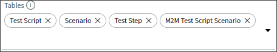

# Lab 0: Introduction

## Goal
The Story Testing Scripts Scoped Application lab will guide users on how to use ServiceNow&reg; Studio IDE to build out a custom application that helps create test scripts for stories. Developers are often confused on what requirements are needed by the quality assurance team for testing. This will break down the test script process into what users they should be impersonating, the steps they should be taking and more. This lab will go over what should be included in a best practice test script and how to build a scoped application to record test scripts in ServiceNow instead of in Excel or another system. This lab will touch developers on Studio IDE, story best practices, scoped applications, and process improvement.

# Lab 1: The Fundamentals of Testing Scripts
Test scripts are used to ...

Test Management: definition
Automated Test Framework: definition

## What are testing scripts and why should I use them?
Steps for enabling Agile Development, Test Management, and Automated Test Framework. << can we have the labs already configured on student >> 
1. Enable plugins
a. Agile Development 2.0
b. Agile development 2.0 ATF Tests
c. Test Management 2.0
d. Test Management 2.0 - ATF Tests 
e. Automated Test Framework (already enabled)

## Planning the layout of our application
 - insert our spreadsheet  pdf -
 
# Lab 2: Starting with ServiceNow&reg; Studio IDE

## Create the Scoped Application

1. Navigate to **System Applications > Studio.**  

2. Click the **Create Application** button.  

3. Click the **Let's get started** button on the "Welcome to the new way to set up your apps"

4. Fill out the following values on the "General Info" tab:

**Name:** Story Testing Scripts  
**Description:** Create testing scripts for stories.  
**Scope:** x_441376_sts (Note, your instance may have a different number.  

5. Drag the "checkbox.png" image from the lab files to the "Drag or drop" icon area.

6. Verify all the information is correct and click **Create**  

7. On the "Let's create some roles for this app", click the **+Create new role** 

8. Enter in "test_script_user" in the "New role name" field and click **Create**  

9. The role should now appear in the "Roles" list with the scope in front of it.

10. Click **Continue** to go to the next step.

11. Our application will be used on stories in the classic view of ServiceNow. Select **Classic** and click **Continue** to go to the next page.  

12. You should now see the "Which data tables do you want to use for this app?" We will be building out new tables based on the arhitecture we mentioned previously in lab 1. Click on **Create new table**.  

13. On the next screen select the **Create table from scratch** and click **Continue**.  

14. We will be createing a table for the test scripts first. Go ahead and click **Add a new field** and put in the following:  
  

Add the following fields to the Test Script table:

Field Label | Field Name | Type | Length | Reference
------------ | ------------- | ------------- | ------------- | -------------
Name | name | String | 40 |
Description | description | String | 1000 |
Story | story | Reference | 32 | Story [rm_story]
Tested By | tested_by | Reference | 32 | User [sys_user]
Reviewed By | reviewed_by | Reference | 32 | User [sys_user]
Version | version | Integer |  | 
QA Tester's Notes | qa_tester_s_notes | String | 1000
Reviewer's Notes | reviewer_s_notes | String | 1000

15. Click **Continue** after you have added all the fields to the table.

16. Now we will name the table the following:

**Table label:** Test Script  
**Table name:** x_441376_sts_test_script (Your instance may have a different number in the table name.)
**Make extensible:** true

17. Click the **Continue** button to create the table. It may take the system a few seconds to create the table.

18. You should see a "Success! Your table is ready" screen. Click on **continue** to build the Scenario table next.

19. You should see the "Test Script" table is now in the "Tables" field of our app. We now need to add the Scenario table next. Let's go through the same proccess and click **Create new table**.

20. Click on the **Create table from scratch** and then click **Continue**.

21. Now you should see the "+ Add a new field" screen. Go ahead and click **+ Add a new field** to add the fields for the Scenario table with the information below.

Add the following fields to the Scenario table:

Field Label | Field Name | Type | Length | Reference
------------ | ------------- | ------------- | ------------- | -------------
Name | name | String | 40 |
Description | description | String | 1000 |  
Prerequisites | prerequisites | String | 1000 | 
Personas | personas | String | 1000 | 
Company | company | Reference | 32 | Company [core_company]

22. Verify the fields and click **continue** to go to the table naming page.  

23. Name the table with the information below and then click **Continue** to create the table.It may take a few seconds for the table to be created.

**Table label:** Test Script  
**Table name:** x_441376_sts_scenario (Your instance may have a different number in the table name.)
**Make extensible:** true  

24. You should see the "Success! Your table is ready" page. Click **Continue** to move onto the next page.

  

25. You should now see the "Test Script" table and the "Senario" table listed in the tables for your application. We are going to repeat the process one more time for the "Test Steps" table. Go ahead and click **Create new table**.

  

26. Click on the **Create table from scratch** and then click **Continue**.

27. Now you should see the "+ Add a new field" screen. Go ahead and click **+ Add a new field** to add the fields for the Test Steps table with the information below.

Add the following fields to the Test Steps table:

Field Label | Field Name | Type | Length | Reference
------------ | ------------- | ------------- | ------------- | -------------
Number | number | String | 40 |
Description | description | String | 1000 |
Input Variables | input_variables | String | 1000 | 
Expected Results | expected_results | String | 1000 | 
Actual Result | actual_result | String | 1000 | 
Result State | result_state | Choice | Dropdown with none  | 

28. Verify the fields and click **continue** to go to the table naming page.  

29. Name the table with the information below and then click **Continue** to create the table.It may take a few seconds for the table to be created.

  

**Table label:** Test Step 
**Table name:** x_441376_sts_test_step (Your instance may have a different number in the table name.)
**Make extensible:** true  

30. You should see the "Success! Your table is ready" page. Click **Continue** to move onto the next page.  

  

31. You should now see the "Test Script", "Senario", and "Test Step" table listed in the tables for your application. We have completed creating all the tables we need for our application. Click **Done with tables**.  

 

32. You should now be on the "OK. It's time to design your apps!" page. On our classic application click **start** to jump into Lab 3. 

 

# Lab 3: How to design your application.

1. You should be on the "OK. Let's customer the design of your Classic App" screen. Fill in the the application details as you see them below. When you are ready, click **Create** to create the application.  

  

**Name:** Story Testing Scripts  
**Description:** Create testing scripts for stories.  
**Tables:** Test Script, Scenario, Test Step  
**Roles:** sdlc_user  

2. You should now be on the "Nice! Here are the apps you've designed so far" screen. Review your Story Testing Scripts appliation and click **Done with apps**.   

3. Now that the app is created, you can click **Done** on the next page.

4. In the "Select Application" menu. Select the "Story Testing Scripts" by clicking on the **Story Testing Scripts** name.  

  

5. Now we will work on setting up the form layouts for all the tables. In the Application Explorer go to **Data Model -> Tables -> Test Script**.  

 

6. The Test Script table should show up in a new tab in the Studio conetent frame. Scroll down to the bottom of the Test Script table record. Click on **Design Form** in the related list section of the table record.  

 

7. In the Form Designer, change the first section to be a **2 Column layout**. Then drag the Name, Version, Story, Reviewed By, and Tested By fields to the top section. Move the Description field to the bottom 1 column section. There should be no fields in the middle section. Go ahead and delete the section by clicking on the **X** in the corner. Finally, click the **Save** button to save the layout.

  

Notice that a **Forms & UI -> Forms -> Test Script [Default view]** menu option was created in the Studio Application Explorer.  

8. Now we will work on setting up the form layout for the scenario table. In the Application Explorer go to **Data Model -> Tables -> Scenario**.

9. The Scenario table should show up in a new tab in the Studio conetent frame. Scroll down to the bottom of the Scenario table record. Click on **Design Form** in the related list section of the table record. 

  

10. In the Form Designer, add a new section by clicking on the **+**. Make the new section a 1 Column section by clicking the **2 Column** drop-down list and selecting **1 Column**. Drag down the **Prerequisites** and **Description** fields down to the new section on the bottom. Next change the the top Scenario section to a 2 Column section by clicking **1 Column** in the drop-down list and selecting **2 Column**. Now drag the **Personas** and the **Company** field to the right side of the top section. If it matches the video below, go ahead and click **Save**.

  

Notice that a **Forms & UI -> Forms -> Scenario [Default view]** menu option was created in the Studio Application Explorer.  

11. Now we will work on setting up the form layout for the scenario table. In the Application Explorer go to **Data Model -> Tables -> Test Step**.

12. The Test Step table should show up in a new tab in the Studio conetent frame. Scroll down to the bottom of the Test Step table record. Click on **Design Form** in the related list section of the table record. 

  

13. ******** UPDATE In the Form Designer, add a new section by clicking on the **+**. Make the new section a 1 Column section by clicking the **2 Column** drop-down list and selecting **1 Column**. Drag down the **Prerequisites** and **Description** fields down to the new section on the bottom. Next change the the top Scenario section to a 2 Column section by clicking **1 Column** in the drop-down list and selecting **2 Column**. Now drag the **Personas** and the **Company** field to the right side of the top section. If it matches the video below, go ahead and click **Save**.

  

Notice that a **Forms & UI -> Forms -> Scenario [Default view]** menu option was created in the Studio Application Explorer.  

100. 

Result State choice list:

Label |  Name | Type 
------------ | ------------- | ------------- 
Pass | pass | String 
Fail | fail | String 
Suspended | suspended | String 
Not Tested | not_tested | String 

# Lab 4: Recording Test Scripts

# Lab 5: Best Practices
## How to create successful testing scripts. 

# Lab 6: Extra Credit

## How to publish my scoped application to an update set
Goto docs and dev
## How to publish my scoped application to the ServiceNow&reg; Share
goto to share
## Other areas to expand the Testing Scripts Scoped Application. 
check with test management and atf
