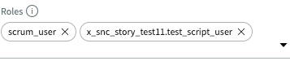
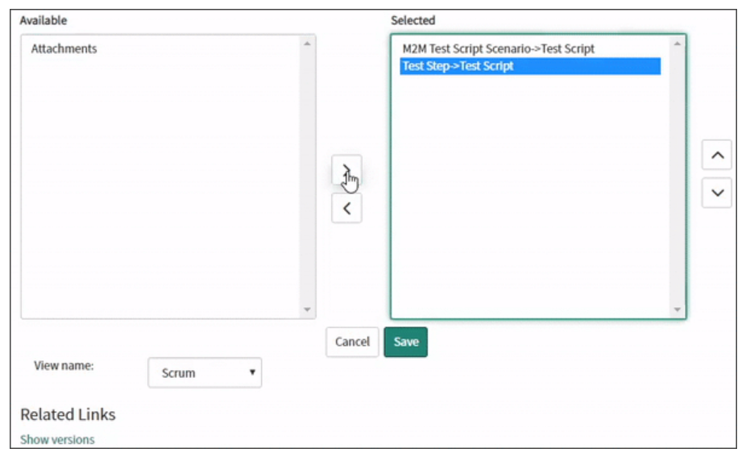
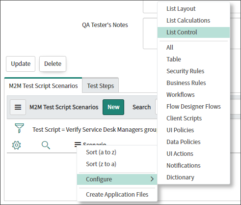
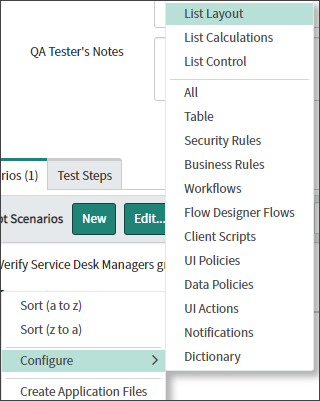
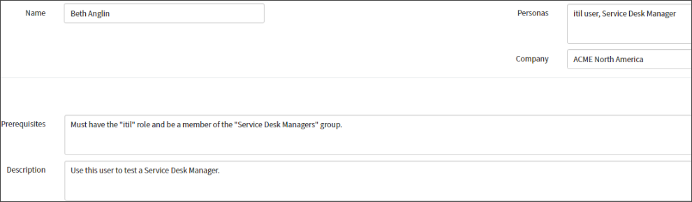
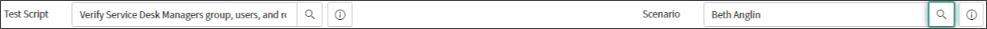
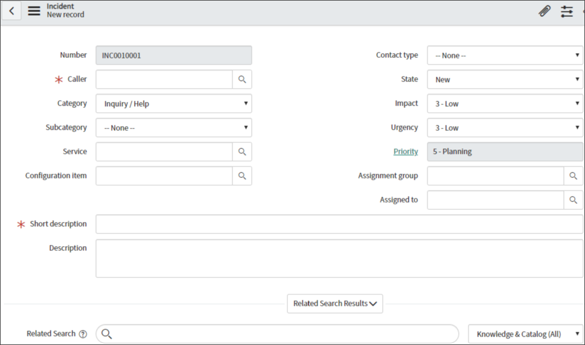
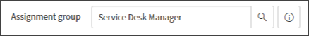
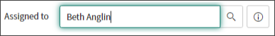

# Lab 0: Introduction

## Goal
The Story Testing Scripts Scoped Application lab will guide users on how to use ServiceNow&reg; Studio IDE to build out a custom application that helps create test scripts for stories. Developers are often confused on what requirements are needed by the quality assurance team for testing. This will break down the test script process into what users they should be impersonating, the steps they should be taking and more. This lab will go over what should be included in a best practice test script and how to build a scoped application to record test scripts in ServiceNow instead of in Excel or another system. This lab will touch developers on Studio IDE, story best practices, scoped applications, and process improvement.

# Lab 1: The Fundamentals of Testing Scripts
Test scripts are sets of instructions that can be performed on a system to validate the behaviour is working as expected for the given functionality. 

## What are testing scripts and why should I use them?
There are two applications in ServiceNow for executing test scripts: 
  * Test Management - used to manage manual testing 
  * Automated Test Framework - used for automated testing

In this lab, we will configure the platform to use both applications.

Make sure that on your instance you have the following Plugings Installed and activated:
  * a. Agile Development 2.0 (Paid Plugin)
  * b. Agile Development 2.0 ATF Tests (Optional)
  * c. Test Management 2.0 
  * d. Test Management 2.0 - ATF Tests (Optional)
  * e. Automated Test Framework (Already Enabled)

If you do not have them installed Navigate to ServiceNow Desktop UI and search for "Plugin" in the left navbar. Installation should take about 5 minutes.

## Planning the Layout of Our Application
In this lab, we've identified a commonly used test template using excel. We've high-lighted where to potentially track other values so that integration with Test Management and Automated Test Framework can be implemented.

  

# Lab 2: Starting with ServiceNow&reg; Studio IDE

## Create the Scoped Application

1. Navigate to **System Applications > Studio.**  

2. Click the **Create Application** button.  

3. Click the **Let's get started** button on the _Welcome to the new way to set up your apps_.

4. Fill out the following values on the _General Info_ tab:

**Name:** Story Testing Scripts  
**Description:** Create testing scripts for stories.  
**Scope:** x_snc_sts_11 (Note: If you get an error that the scope already exists, replace "11" in the scope with another number.)

5. **Optional:** Right click the **checkmark_icon.png** image below and select **"Save Image As..."**. Open the folder where you saved the checkmark_icon.png and **_Drag and drop_** it to the icon area in the application creator.

6. Verify all the information is correct and click **Create**.  

7. On the _Let's create some roles for this app_, search for **scrum_user** role and insert it. After you inserted srum_user role click the **Create new role**. 

8. Enter in **test_script_user** in the _New role name_ field and click **Create**.  

9. The role should now appear in the **Roles** list with the scope in front of it.

10. Click **Continue** to go to the next step.

11. Our application will be used on stories in the classic view of ServiceNow. Select **Classic** and click **Continue** to go to the next page.  

12. You should now see the _Which data tables do you want to use for this app?_ We will be building out new tables based on the architecture we mentioned previously in lab 1. Click on **Create new table**.  

13. On the next screen select the **Create table from scratch** and click **Continue**.  

14. We will be creating a table for the **Test Script** first as seen below in our schema map. 

Go ahead and click **Add a new field** and put in the following:  

  

Add the following fields to the Test Script table:

Field Label | Field Name | Type | Length | Reference
------------ | ------------- | ------------- | ------------- | -------------
Name | name | String | 100 |
Description | description | String | 1000 |
Story | story | Reference | 32 | Story [rm_story]
Tested By | tested_by | Reference | 32 | User [sys_user]
Reviewed By | reviewed_by | Reference | 32 | User [sys_user]
Version | version | Integer |  | 
QA Tester's Notes | qa_tester_s_notes | String | 1000
Reviewer's Notes | reviewer_s_notes | String | 1000

15. Click **Continue** after you have added all the fields to the table.

16. Now we will name the table the following:

**Table label:** Test Script  
**Table name:** x_441376_sts_test_script (Your instance may have a different number in the table name.)   
**Make extensible:** true

17. Click the **Continue** button to create the table. It may take the system a few seconds to create the table.

18. You should see a _Success! Your table is ready_ screen. Click on **continue** to build the Scenario table next.

19. You should see the **Test Script** table is now in the **_Tables_** field of our app. We now need to add the Scenario table from our schema map. Let's go through the same proccess and click **Create new table**.

20. Click on the **Create table from scratch** and then click **Continue**.

21. Now you should see the **+ Add a new field** screen. Go ahead and click **+ Add a new field** to add the fields for the Scenario table with the information below.

Add the following fields to the Scenario table:

Field Label | Field Name | Type | Length | Reference
------------ | ------------- | ------------- | ------------- | -------------
Name | name | String | 100 |
Description | description | String | 1000 |  
Prerequisites | prerequisites | String | 1000 | 
Personas | personas | String | 1000 | 
Company | company | Reference | 32 | Company [core_company]

22. Verify the fields and click **Continue** to go to the table naming page.  

23. Name the table with the information below and then click **Continue** to create the table. It may take a few seconds for the table to be created.

**Table label:** Scenario  
**Table name:** x_441376_sts_scenario (Your instance may have a different number in the table name.)   
**Make extensible:** true  

24. You should see the _Success! Your table is ready_ page. Click **Continue** to move onto the next page.

  

25. You should now see the **Test Script** table and the **Senario** table listed in the tables for your application. We are going to repeat the process two more times for the **Test Step** and **M2M Test Script Scenario** table. Go ahead and click **Create new table**.

  

26. To create the **Test Step** table from the schema map, click on the **Create table from scratch** and then click **Continue**.

27. Now you should see the **+ Add a new field** screen. Go ahead and click **+ Add a new field** to add the fields for the Test Steps table with the information below.

Add the following fields to the Test Steps table:

Field Label | Field Name | Type | Length | Reference
------------ | ------------- | ------------- | ------------- | -------------
Number | number | Integer |  |
Description | description | String | 1000 |
Input Variables | input_variables | String | 1000 | 
Expected Results | expected_results | String | 1000 | 
Actual Result | actual_result | String | 1000 | 
Result State | result_state | Choice | Dropdown with none  | 
Test Script | test_script | Reference | 32 | Test Script [x_441376_sts_test_script]

28. Verify the fields and click **Continue** to go to the table naming page.  

29. Name the table with the information below and then click **Continue** to create the table. It may take a few seconds for the table to be created.

  

**Table label:** Test Step   
**Table name:** x_441376_sts_test_step (Your instance may have a different number in the table name.)  
**Make extensible:** true  

30. You should see the _Success! Your table is ready_ page. Click **Continue** to move onto the next page.  

31. You should now see the **Test Script** table, **Senario** table and **Test Steps** table listed in the tables for your application. We are going to repeat the process one last time for the **M2M Test Script Scenario** table. Go ahead and click **Create new table**.

32. Finally let's make the **M2M Test Script Scenario** table from the schema map. Click on the **Create table from scratch** and then click **Continue**.

33. Now you should see the **+ Add a new field** screen. Go ahead and click **+ Add a new field** to add the fields for the M2M Test Script Scenario table with the information below.

Field Label | Field Name | Type | Length | Reference
------------ | ------------- | ------------- | ------------- | -------------
Scenario | scenario | Reference |  32  | Scenario [x_441376_sts_scenario] | 
Test Script | test_script | Reference | 32 | Test Script [x_441376_sts_test_script] |

34. Verify the fields and click **Continue** to go to the table naming page.  

35. Name the table with the information below and then click **Continue** to create the table. It may take a few seconds for the table to be created.

 

**Table label:** M2M Test Script Scenario   
**Table name:** x_441376_sts_m2m_test_script_scenario (Your instance may have a different number in the table name.)  
**Make extensible:** true 

36. You should see the _Success! Your table is ready_ page. Click **Continue** to move onto the next page. 

37. You should now see the **Test Script**, **Senario**, and **Test Step**, **M2M Test Script Scenario** table listed in the tables for your application. We have completed creating all the tables we need for our application. Click **Done with tables**.  

 

38. You should now be on the _OK. It's time to design your apps!_ page. On our classic application click **Start** to jump into Lab 3. 

 

# Lab 3: How to Design Your Application  
## Designing the Layout

1. You should be on the _OK. Let's customize the design of your Classic App_ screen. Fill in the the application details as you see them below. When you are ready, click **Create** to create the application.  

  

**Name:** Story Testing Scripts  
**Description:** Create testing scripts for stories.  
**Tables:** Test Script, Scenario, Test Step, M2M Test Script Scenario  
**Roles:** test_script_user, scrum_user  

2. You should now be on the _Nice! Here are the apps you've designed so far_ screen. Review your Story Testing Scripts appliation and click **Done with apps**.   

3. Now that the app is created, you can click **Done** on the next page.

4. In the **Select Application** menu. Select the **Story Testing Scripts** by clicking on the **Story Testing Scripts** name.  

  

5. Now we will work on setting up the form layouts for all the tables. In the Application Explorer go to **Data Model -> Tables -> Test Script**.  

 

6. The Test Script table should show up in a new tab in the Studio content frame. Scroll down to the bottom of the Test Script table record. Click on **Design Form** in the related list section of the table record.  

 

7. * In the Form Designer, change the first section to be a **2 Column layout**. 
   * Then drag the Name, Version, Story, Reviewed By, and Tested By fields to the top section.
   *  Move the Description field to the bottom 1 column section. 
   * There should be no fields in the middle section. 
   * Go ahead and delete the section by clicking on the **X** in the corner. 
   * Finally, click the **Save** button to save the layout.

  

The Test Script Form layout should look like the following picture.

Close the Form Design tab in your browser and go back to the Studio Application Explorer, you should notice that a **Forms & UI -> Forms -> Test Script [Default view]** menu option was created in the Studio Application Explorer.  

8. Now we will work on setting up the form layout for the scenario table. In the Application Explorer go to **Data Model -> Tables -> Scenario**.

9. The Scenario table should show up in a new tab in the Studio content frame. Scroll down to the bottom of the Scenario table record. Click on **Design Form** in the related list section of the table record. 

  

10. * In the Form Designer, add a new section by clicking on the **+**. 
    * Make the new section a 1 Column section by clicking the **2 Column** drop-down list and selecting **1 Column**. 
    * Drag down the **Prerequisites** and **Description** fields down to the new section on the bottom. 
    * Next change the the top Scenario section to a 2 Column section by clicking **1 Column** in the drop-down list and selecting **2 Column**. 
    * Now drag the **Personas** and the **Company** field to the right side of the top section. 
    * If it matches the video below, go ahead and click **Save**.

  

Scenario Form layout should look like the following picture.

Close the Form Design tab in your browser and go back to the Studio Application Explorer, you should notice that a **Forms & UI -> Forms -> Scenario [Default view]** menu option was created in the Studio Application Explorer.  

11. Now we will work on setting up the form layout for the scenario table. In the Application Explorer go to **Data Model -> Tables -> Test Step**.

12. The Test Step table should show up in a new tab in the Studio conetent frame. Scroll down to the bottom of the Test Step table record. Click on **Design Form** in the related list section of the table record. 

  

13. In the Form Designer, drag the **Description** field above the **Input Variables** field in the Test Step section. Once completed, click **Save**.  

  

Test Step Form layout should look like the following picture.

Close the Form Design tab in your browser and go back to the Studio Application Explorer, you should notice that a **Forms & UI -> Forms -> Test Step [Default view]** menu option was created in the Studio Application Explorer.  

## Add Choices to the Result State Field

1. We now need to add choices to our **Result State** variable on the Test Step table. Navigate to **Data Model -> Tables -> Test Step**.

2. Under the **Columns** tab, click on the **Result State** dictionary entry record.

3. At the bottom of the Result State dictionary entry, click on the **Choices** tab and then click **New** to create a new choice.

  

4. In the new choice record make sure the fields are filled out with the below information. Verify the information in the form and click **Submit** to submit the choice.

Label |  Value | Element | Sequence
------------ | ------------- | ------------- | -------------
Pass | pass | result_state | 0  

  

5. Once you submit the form it will return you back to the choice you just submitted. Add the remaining choices below by changing the information on the choice. Then right-click the top banner and click **Insert and Stay**.

Result State choice list:

Label |  Value | Element | Sequence
------------ | ------------- | ------------- | -------------
Fail | fail | result_state | 10
Suspended | suspended | result_state | 20
Not Tested | not_tested | result_state | 30

After inserting all of the choices you should see them in choice list.

## Add Test Scripts as a Related List

Next we will work on creating a global update set to capture the Test Script related list we will be adding to the Story form.

1. Let's navigate to **Data Model -> Tables -> Test Script**.

 

2. Scroll down to related links and select **Show Form**.

  

3. In the Test Script Form right click on the top banner and go to **Configure -> Related Lists**.

  

4. You should now see the related list, list collector for the Scrum view. In the Available list on the left select **M2M Test Script Scenario->Test Script** and **Test Step->Test Script** to highlight it. To move it over to the Selected list on the right, click the > icon. Once the **M2M Test Script Scenario->Test Script** and **Test Step->Test Script** related list has been moved over, click the **Save** button.

End Result:

5. Now let's work on adding an "Edit..." button and changing the columns on the M2M Test Script Scenario related list on a Test Script record. On Studio, navigate back to the Test Script table.

 

6. On the bottom of the Test Script table record, click **Show List** in the related links section.

7. Click the **New** button at the top of the Test Scripts' list to create a new record.

8. In order to see the related lists that we added earlier to the Test Script form, we need to save the record. You can leave the form blank for now and **Right-click** the top banner on the record and select **Save** from the drop-down menu.

9. For M2M Test Script Scenario we would like to add an edit button to manage scenarios easier. For this we go to column options and choose Configure List Control.  

10. In List Control uncheck the **Omit Edit Button** checkbox and at the bottom of the form, click the **Enable Edit** button.

11. To view more information we will update the the List Layout of M2M Test Script Scenarios by going to **Configure -> List Layout**. 

  

12. Arrange the list layout as shown to view information about the Scenario.  

End Result:

13. Now you should see more infomration about M2M Test Script Scenario.

14. Let's navigate to ServiceNow Desktop UI, here we will turn on the developer Update Set and Scope in the header. Start by clicking on the **gear** icon in the top right corner.

15. Turn on **Show application picker in header** and **Show update set picker in header** under the **Developer** tab.

16. In the application picker in the header, change the application to **Global**.

17. In the left navigation bar, go to **System Update Sets -> Local Update Sets**. 

  

18. At the top of the Update Sets List, click **New**.

19. Fill out the update set with a detailed name and description.

Field |  Value 
------------ | ------------- 
Name | Story Testing Scripts - Global - Story Form Layout
State | In progress
Application | Global
Description | Added the Test Scripts related list to the Story (rm_story) form's scrum view.  

20. Click **Submit and Make Current** to save the update and set it as your current update set. You should now see the new update set in the update set picker in the header.

21. In the left navigation bar, go to **Agile Development -> Stories**.

22. Once the list of stories load **click** on one of the stories to view the stories form. 

23. Next open the form's context menu by **Right clicking** on the form's gray banner at the top. 

24. In the context menu, go to **Configure -> Related Lists**. 

25. You should now see the related list, list collector for the Scrum view. In the **Available** list on the left select **Test Script->Story** to highlight it. To move it over to the **Selected** list on the right, **click** the **>** icon. Once the **Test Script->Story** related list has been moved over, click the **Save** button.

End Result:
 

# Lab 4: Recording Test Scripts

## Build Your First Test Script  

1. Now we are going to build our first test script for a story where the IT Director would like a new **Service Desk Managers** group. In the left navbar, navigate to **Agile Development -> Stories**.

2. In the stories list search for **STRY0018788** in the number field and **click** on the story field when it loads. 

3. After reviewing the story, let's create a new test script. Find the **Test Scripts** related list and click **New**.

4. On the new Test Script form fill in the following information:

**Name:** Verify Service Desk Managers group, users, and roles  
**Story:** The IT Director would like a new group in ServiceNow called **Service Desk Managers**    
**Description:** This test should check that the Service Desk Managers group was created. That at least one of the users in the group is now apart of that group. Lastly check another user in the group for the **itil** role.  
**Version:** 1   

5. Click **Submit** to create the test script.

6. Now that the Test Script is all filled out, we will create a new scenario for our test script. In the left navigation bar go to **Story Testing Scripts > Scenario > Create New**

7. In the new choice record, make sure the fields are filled out with the below information. Verify the information in the form and click **Submit** to create the choice.   

**Name:** Beth Anglin  
**Personas:** itil user, Service Desk Manager  
**Company:** ACME Americas    
**Prerequisites:** Must have the **itil** role and be a member of the **Service Desk Managers** group.  
**Description:** Use this user to test a Service Desk Manager.

8. After Creating a Scenario with Beth Anglin we need to create Alissa Mountjoy and Alfonso Griglen. We will start with Alfonso Griglen. Fill in the fields with provided information.  

**Name:** Alfonso Griglen  
**Personas:** General user with no roles  
**Company:** ACME China  
**Prerequisites:** Make sure this user has no roles assigned to them.  
**Description:** Basic user with no roles.  

9. Let's go back to Test Script by using ServiceNow's Histoy Tab in the left navbar. Click the clock icon in the left navbar.

10. Select the **Test Script - Verify Service Desk Managers group, users, and roles** record in the history list.

11. Scroll to the bottom of the Test Script to the **M2M Test Script Scenarios** related list and clicking **New** .  

12. In the M2M Test Script Scenario form we select the Scenario magnifying glass and search for our created Scenario and Press **Submit**

  

13. Now the Test Scripts, M2M Test Script Scenarios should have newly inserted Scenario of Beth Anglin. Do the same steps for Alfonso Griglen.  

  

14. The next step is creating couple of Test Steps. Go back to the Test Script form and select **Test Step** next to M2M Test Script Scenarios and click on **New**.

15. In the new Test Step record make sure the fields are filled out with the below information. Verify the information in the form and click **Submit**.    

**Number:** 1  
**Description:** Impersonate Beth Anglin
**Input Variables:** username=beth.anglin     
**Expected Results:** Once Beth Anglin is impersonated, you should be redirected to her account ServiceNow Desktop UI.  
**Actual Results:**

16. Repeat the process of filling the Test Step with the following information, and press **insert and stay** on the top bar.

**Number:** 2  
**Description:** Navigate to Incidents > Create New  
**Input Variables:** N/A    
**Expected Results:** Opens a blank Incident to be submited  
**Actual Results:**  

**Number:** 3  
**Description:** Attempt to assign new incident to the **_Service Desk Managers_** group. This will prove that the group has been created in the ServiceNow  
**Input Variables:** Assignment Group = Service Desk Managers    
**Expected Results:** Assignment Group field is filled in with Service Desk Managers  
**Actual Results:**  

**Number:** 4  
**Description:** Assign Beth Anglin to the Assigned to field on the incident, fill in the remaining mandatory fields, and submit the incident. Service Desk Managers group should already be selected on the incident from the previous step.  
**Input Variables:** Caller = Abel Tuter, Short description = My computer will not turn on after I spilled my coffee. Assignment Group = Service Desk Managers, Assigned To = Beth Anglin    
**Expected Results:** Beth Anglin gets filled in the Assigned to field on the incident. The field does not throw an error saying the user does not excist  
**Actual Results:** 

17. Lets create Test Steps for Alfonso Griglen, user that does not have any roles.

**Number:** 5  
**Description:** Impersonate Alfonso Griglen  
**Input Variables:** username=alfonso.griglen  
**Expected Results:** Once Alfonso Griglen is impersonated, you should be redirected to her account ServiceNow Desktop UI.  
**Actual Results:** 

**Number:** 6  
**Description:** Navigate to Self-Service > Incidents
 **Input Variables:** N/A    
**Expected Results:** Brings the user to the Incidents list view.
**Actual Results:**

**Number:** 7
**Description:** Click the "New" button on the top of the Incidents list.
 **Input Variables:** N/A    
**Expected Results:** Opens a Self-Service Incident request  
**Actual Results:**

18. Development on STRY0018788 has already been completed on your lab instance. The "Service Desk Managers" group has been created with the "itil" role and Beth Anglin has been added to it. Now that we created some test steps, lets test them out. The first step mentions that we need to impersonate Beth. In the top banner, **click** on your **System Administrator** name to open the user menu.

19. In the user menu drop-down, select **Impersonate User**.

20. You should now see a pop-up modal. In the **Search for user** field search for Beth Anglin and **click** her name. You should be redirected to the ServiceNow Desktop UI view and your name in the top banner should change to **Beth Anglin**.

21. Our next Test Step is to go to left Filter Navigator and navigate to **Incident > Create New**. There you should see a blank Incident to be submited.  

22. The 3rd Step in our test steps is to attempt to assign the **Service Desk Managers** assignment group to the Incident. If the **Service Desk Managers** group shows up, it means it exists in ServiceNow and this test step passes.

23. Test the 4th test step by assigning Beth Anglin to the Assigned to. If you are able to **Submit** the incident with the below values, then all the test steps for Beth have passed, meaning the **Service Desk Managers** group has been created and **Beth Anglin** has been assigned to it.

**Caller:** Abel Tuter
**Short description:** My computer will not turn on after I spilled my coffee. 
**Assignment Group:** Service Desk Managers
**Assigned To:** Beth Anglin  

24. Moving on to the 5th test step, we will be impersonating Alfonso Griglen. Go ahead and repeat steps 18-20 by **clicking** on the name in the top banner (Beth Anglin right now), selecting **Impersonate User** in the drop-down menu, and selecting **Alfonso Griglen** in the "Search for user" field. Once you complete those steps you should be directed to the ServiceNow Desktop UI page with **Alfonso Griglen** as the name in the top banner.

25. Now for the 6th test step, go to **Self-Service -> Incidents** in the left navbar. You should be directled to the list view of incidents.

26. For the final step, click **New** on top of the incidents list. If you are directed to the **Create Incident** catalog item shown below, then the test has suceeded as Alfonso.

# Lab 5: Best Practices
## How to Create Successful Testing Scripts. 

Story Testing Scripts Scoped Application is powerful tool to help developers create test scripts for stories. Using well defined requirements to assure the team for testing. This application is easy to use and it is very descriptive of its functionality. Here are some best practices for one should follow in designing the Story Testing Scripts Scoped Application:

1. **Define involved users and roles of the story**
    * Check the stories that are present in the story and understand what they do.
    * Understand what users are involved in the story and if they are relavant to it.

2. **Create a Test Script**
    * Using the Description of the story define the problem and solution of the story.
    * Identify who will be reviewing and testing the story.

3. **Create Scenario for the Story**
    * With the defined task we create a Scenario with users that are relavant to the story.
    * Clearly define the prerequisite fields with all necessary roles, groups and other configuration requirements.  
    * Write a clear description for a scenario.

4. **Create M2M Test Script Scenarios**
    * Verify that the users and the information about their task is useful for testing.

5. **Create Test Steps**
    * Using Story and users involved define steps that need to be taken to verify the resolved story.
    * Write a clear Description for Tester to fulfill a given test task.
    * If needed include Input Variables that the Tester would use.
    * Write out what results should the Tester see when the task is being done.

# Lab 6: Extra Credit

## How to publish your scoped application to an update set
When you publish an application, it creates an update set with the current version of all the application configuration records.

1. In the left navigation bar **System Applications -> My Company Applications**.  

2. Click the **In Development** tab.

3. Click the application record you want to create an update set for. 

4. Click the **Publish to Update Set** related link.

5. For best practice, fill in the **Version** and **Description** fields as appropriate. In our case, we will use the information below.

6. If all the information looks good, click **Publish**.

7. Once the update set has completed you will be redirected to the **Story Testing Scripts** update set. You can now download your update set by clicking **Export to XML** in the related links.

  

8. Now you can import it into a personal developer instance running **Orlando** or greater.

## How to publish your scoped application to the ServiceNow&reg; Share
Here are sample instructions for publishing a scoped app to Share:

https://developer.servicenow.com/blog.do?p=/post/publishing-spoke-to-share/

https://developer.servicenow.com/blog.do?p=/post/first-share-item/

## Other areas to expand the Testing Scripts Scoped Application
Provide info on getting scoped app certified on Store
integration with test mgmt and ATF:

https://developer.servicenow.com/blog.do?p=/post/o-atf/

https://developer.servicenow.com/blog.do?p=/tags/automated-test-framework/
